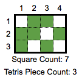
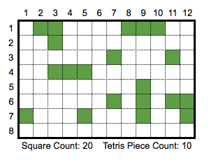

# Altru Front-end Take-home Exercise
Hello! Welcome to Altru's take home front-end engineering exercise. We know that these types of challenges can be tedious especially when juggling a number of interview processes, so we really appreciate you taking time out of your schedule to tackle this exercise, and we've done our best to make it compact and intersting.

This should take no more than 2-3 hours to complete. If it looks like it's going to take longer, more please let us know so we can focus the requirements more carefully, we want to be respectful of your time and that's easier to do if we overcommunicate during the process.

Now, with that out of the way, on to the good stuff!

## Objective
Build a randomized Tetris board, display it to the user, and count the number of distinct pieces on the board.

### Product Requirements:
- The app accepts 3 arguments: Width, Height, and Square Count.
- Based on those three arguments, generate a board of the appropriate dimensions and randomly place the input number of blocks on the board.
- Display this board to the user.
- Finally, the app should display a count of the number of distinct tetris pieces displayed the random board.
- For the purposes of this project, a tetris piece is any collect of 1 or more blocks that are all connected with one another at least one of their 4 sides (diagonals don't count).

### Example 1
input = ```{
  width: 4,
  height: 3,
  squares: 7
}```




### Example 2
input = ```{
  width: 12,
  height: 8,
  squares: 20
}```



### Technical Requirements:
- You can use any frameworks, libraries, or technologies you choose.
- We recommend sticking with front end technologies but if you really think a PHP server will help, go for it.
- The finished product must run in the current version of Chrome.

### Recommendations:
- The aesthetic of the **app does not matter**! The interface doesn't have to be pretty, but the few elements needed to construct the UI should be well organized and clearly defined.
- There are a lot of different solutions to similar problem on the web, we can't stop you from checking them (actually we encourage it), but don't copy code.
- Commit early and often, it's useful to see your progression. We follow the pattern [red-green-refactor](https://www.codecademy.com/articles/tdd-red-green-refactor), there showing the workflow you followed is encouraged.

### Deliverables:
- When completed, submit a form of this repo that contains all the files needed to run your app.
- When you're done, please replace this README with a few sentences on how to run the app, and if there's anything you would like us to know about the task. The more communication the better!

If you have any questions please don't hesitate to email or call, can't wait to see what you come up with!
- The Altru Team
